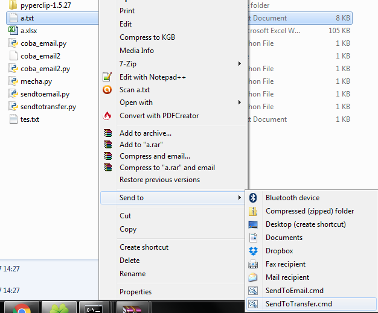
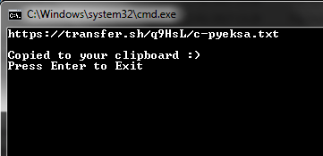

# ContextMenuFileTransfer

##Cara Instalasi
1. Tempatkan folder poster, pyperclip, dan sendtotransfer.py pada suatu direktori.
2. Buka Windows explorer , di address bar ketik shell::SendTo. Windows Explorer akan menampilkan sebuah direktori. Masukkan file SendToTransfer.cmd dalam folder itu
3. Buka file SendToTransfer.cmd , sesuaikan ke direktori file sendtotransfer.py berada

##Cara Menggunakan

